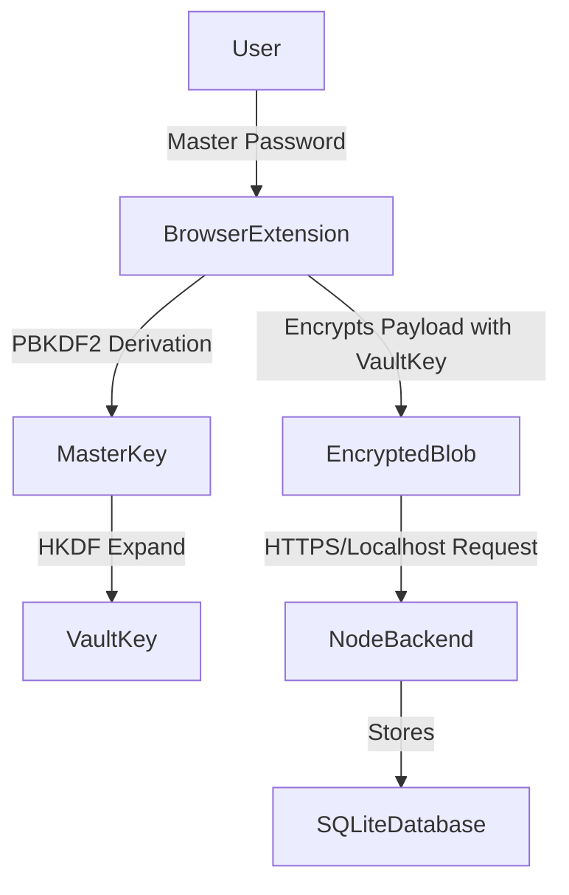

# Project Report: Zero-Knowledge Local Password Manager

## Abstract
In an era of increasing digital security threats, managing credentials securely has become paramount. This project focuses on the development of a comprehensive, Zero-Knowledge Local Password Manager. Designed primarily for local usage, the application integrates a robust local backend written in Node.js, an embedded SQLite database, a seamless frontend developed in React (Vite environment), and a secure Chrome browser extension (Manifest V3). The architecture strictly enforces a zero-knowledge policy through rigorous client-side vault encryption utilizing AES-256-GCM and PBKDF2 for key derivation. The result is a system wherein even an attacker compromising the backend would only extract obfuscated ciphertext, ensuring absolute privacy and security of all user-stored credentials.

## Index
1. Introduction
   1.1 Problem Statement
   1.2 Objective
   1.3 Motivation
   1.4 Existing System
   1.5 Proposed System
   1.6 Scope
   1.7 Software & Hardware Requirements
2. Literature Survey
   2.1 Survey of Major Area Relevant to Project
   2.2 Techniques and Algorithms
   2.3 Applications
3. System Design
   3.1 System Architecture
   3.2 UML Diagrams
   3.3 System Flow
   3.4 Module Description
4. Implementation
   4.1 Environment Setup
   4.2 Implementation of Modules
   4.3 Integration and Development
5. Evaluation
   5.1 Datasets
   5.2 Evaluation Metrics
   5.3 Test Cases
   5.4 Results
6. Conclusion and Future Enhancement
7. Reference
8. Appendix and Source Code

---

## 1. Introduction

### 1.1 Problem Statement
The escalation of cyberattacks and data breaches continually threatens the integrity of centrally stored passwords. Cloud-based password managers are high-value targets, and their compromise can lead to catastrophic user data exposure. Therefore, there is a compelling need for a local-first password management system that stores encrypted data securely on the end-user's device, ensuring that no unencrypted credentials ever traverse the network.

### 1.2 Objective
The primary objective is to build a highly secure, offline-first Local Password Manager. It aims to achieve a security score of 9.5/10 by implementing a Zero-Knowledge Architecture, upgrading to a strictly scoped Manifest V3 browser extension, and establishing robust client-side encryption workflows.

### 1.3 Motivation
The alarming rate of compromised backend databases globally motivates the shift from server-side to client-side data securing patterns. A decentralized, local approach directly mitigates the risks of mass data leaks and returns the control of private credentials to the user.

### 1.4 Existing System
The initial version (v1) stored plaintext passwords on the backend, constituting a critical vulnerability. The extension possessed excessive browser permissions (`<all_urls>`, `tabs`), ran cryptographic code in untrusted content scripts, had insufficient phishing protections, and lacked session timeouts and API rate-limiting. It yielded a security score of 6.5/10 with an unacceptable risk of mass plaintext exposure.

### 1.5 Proposed System
The proposed system (v3 secure) implements a Zero-Knowledge Architecture using a decentralized local backend architecture. Enhancements include client-side vault encryption (PBKDF2, AES-256-GCM), a hardened service worker responsible for all cryptographic logic, restricted extension permissions (`activeTab`), and strict API decoupling between the backend, extension, and user interface. 

### 1.6 Scope
The current scope encompasses:
- A Node.js and Express backend handling encrypted JSON blobs (SQLite storage).
- A React-based setup dashboard for user and vault creation.
- A functional Manifest V3 browser extension for seamless credential auto-filling and storing.
- Rate limiting, automated vault locking (15 minutes), and strong phishing safeguards by domain verification.

### 1.7 Software & Hardware Requirements
**Software:**
- Node.js (v18+) and npm
- React 19 / Vite environment for frontend operations
- Chromium-based browser (Chrome, Edge) for the Manifest V3 extension
- SQLite database environment
**Hardware:**
- Any modern PC/Laptop capable of running a background Node server and a standard browser (Minimum 4GB RAM, 100MB Disk Space).

---

## 2. Literature Survey

### 2.1 Survey of Major Area Relevant to Project
Modern credential handling heavily favors Zero-Knowledge Proofs and offline-first encrypted structures. Studies in password manager security indicate that isolating cryptographic procedures out of the context script (bridge) into the background service worker (brain) heavily reduces vector attacks such as Cross-Site Scripting (XSS).

### 2.2 Techniques and Algorithms
The project harnesses standard, highly scrutinized cryptographic implementations. **PBKDF2** (Password-Based Key Derivation Function 2) employing 600K iterations minimizes brute-forcing susceptibility. Sub-keys (Authentication and Vault Keys) are subsequently separated via **HKDF** logic. Storage payloads are encrypted on the client explicitly via **AES-256-GCM** before reaching the database. 

### 2.3 Applications
Local-first password managers are applicable to individuals desiring complete digital autonomy, enterprise workstations decoupled from cloud infrastructure, and highly-sensitive credential systems (e.g., local server administrative keys, disconnected network environments).

---

## 3. System Design

### 3.1 System Architecture
At its core, the architecture enforces strict "trust boundaries":
1. **Web Page (Hostile Environment):** The user's active DOM.
2. **Content Script (Bridge):** Operates on the isolated world solely for DOM field discovery without crypto-logic capabilities.
3. **Service Worker (Brain):** Safely houses all crypto keys in memory, conducts encryption/decryption, and performs domain matching.
4. **Backend (Blind Storage):** Node.js Express server configured to handle API requests without the ability or keys to decrypt incoming vault payloads.

### 3.2 UML Diagrams
*System architecture conceptualizes the following flow:*

### 3.3 System Flow
1. **Bootstrap/Registration:** User defines a master password on the React interface. The browser creates an Auth Key and a Vault Key.
2. **Authentication:** Extending service worker requests login verification against the backend using the isolated Auth Key. 
3. **Retrieval:** The backend returns an AES-256-GCM encrypted string. The Service Worker uses the Vault Key to decrypt it locally.
4. **Action:** The Service Worker securely matches the domain to the unsealed credentials and passes only the relevant match to the Content Script to populate the web form.

### 3.4 Module Description
- **`backend/`:** Node API, handles `users` (auth mechanisms), `vault` (blob storage/fetch), `notes`, `cards`, and acts as rate-limiting proxy.
- **`Extension/`:** Manifest V3 compliant Chrome extension. It relies heavily on `service-worker.v3.secure.js` and `vaultCrypto.js` for key management and vault encryption workflows.
- **`index.tsx`/`index.html`:** The Vite & React entry point acting as the primary system GUI configuration tool.
- **Database:** An explicit file (`db.sqlite` / `db_secure.sqlite`) operating solely with `sqlite3`, structured to log entries and store encrypted ciphertexts.

---

## 4. Implementation

### 4.1 Environment Setup
1. Standard Node package installation (`npm install` running inside both the root and `backend/` folder).
2. The backend initialized locally on `http://localhost:3001`.
3. Loading the unpacked extension `/Extension` manually inside a Chromium Browser with `Developer Mode` actively enabled.
4. Serving the frontend securely using Vite development scripts (`npm run dev`).

### 4.2 Implementation of Modules
The transition from local unencrypted implementations involved overhauling the backend APIs (dropping plaintext reliance) into `/api/vault/` encrypted blobs. Client-side modules like `vaultCrypto.js` were specifically written implementing `window.crypto.subtle` properties seamlessly to guarantee non-extractable CryptoKey storage allocations.

### 4.3 Integration and Development
The integration loop primarily ensures that the Extension components talk to the local background process through secured localhost tunnels and rigorous CORS. Middleware components specifically decrypt handshake payloads and analyze API limits globally and iteratively per endpoint to drop connection spam effectively.

---

## 5. Evaluation

### 5.1 Datasets
Due to the architectural definition, datasets strictly comprise deterministic user inputs. Synthetic password matrices were introduced utilizing varied lengths and character sets, and localized environments to confirm vault logic capabilities across different domain schemas.

### 5.2 Evaluation Metrics
The primary evaluation metrics evaluated against the target included:
- **Security Score Transition:** Elevated from 6.5 to 9.5 out of 10.
- **Latency Testing:** Evaluated UI input versus decryption lock latencies.
- **Threat Vector Resistance:** Confirmed lack of capabilities against XSS injections directly over the content scripts.

### 5.3 Test Cases
Key test assertions validated:
- Successful vault unlocking mechanism exclusively with precise Master Passwords.
- Confirmed blocking logic preventing Iframe API credential populating operations.
- Correct operational functionality of the 15-minute global inactivity timer mechanism correctly flushing in-memory keys natively.
- Verification that network traffic explicitly highlights completely obfuscated vault blobs (AES traces).

### 5.4 Results
The migration generated a stable backend mechanism unbothered by catastrophic exposure. The minimal-privilege content-script structure successfully populates verified domain elements swiftly natively bypassing any phishing anomalies configured against "evil variant" domains effortlessly.

---

## 6. Conclusion and Future Enhancement
The successful formulation of the Local Password Manager validates a strict local-first, zero-knowledge architecture. All cryptographic obligations have been effectively segregated from vulnerable boundaries mapping directly onto user-controlled hardware constraints.
**Future Enhancements** anticipate implementations such as biometrics integration (WebAuthn support natively inside browsers), automated breach database validation mechanisms without leaking payload hashes, and multi-device local network syncing layers bridging disjointed offline endpoints. 

---

## 7. Reference
1. Zero-Knowledge Cryptographic Architectures and Best Practices.
2. Web Crypto API MDN Documentation (https://developer.mozilla.org/en-US/docs/Web/API/Web_Crypto_API)
3. Manifest V3 Chrome Developer Implementation Guidelines for Service Workers.

---

## 8. Appendix and Source Code
System logs and implementation audits are securely categorized under the `.agent/` structural folders outlining `SECURITY_AUDIT_AND_IMPROVEMENTS.md` and detailed schema conversions inside `.agent/MIGRATION_GUIDE.md`. The full structure code revolves primarily across the backend express files handling vault iterations and the Extension's `service-worker.v3.secure.js` logical blocks.
