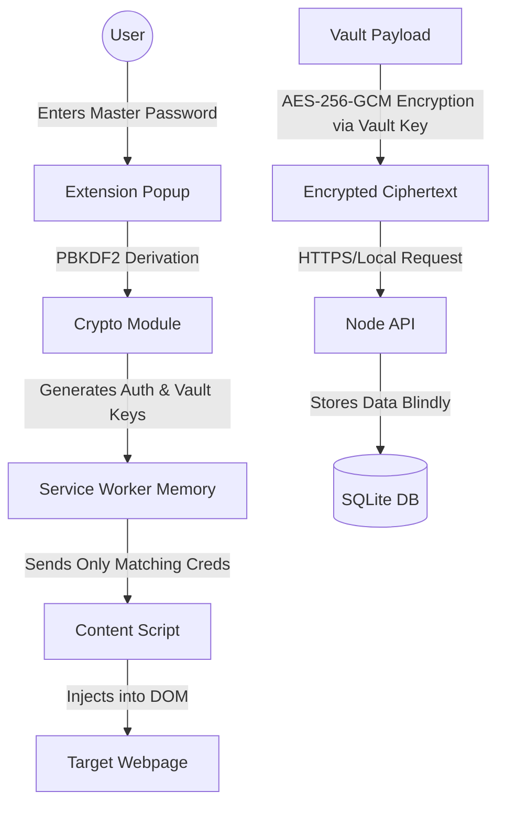

# Detailed Project Report: Zero-Knowledge Local Password Manager

## Abstract
In an era of increasing digital security threats, managing credentials securely has become paramount. Cloud-based password managers present a high-value target for threat actors, meaning a centralized breach can compromise millions of users simultaneously. This project focuses on the development of a comprehensive, Zero-Knowledge Local Password Manager. Designed primarily for local usage, the application integrates a robust local backend written in Node.js, an embedded SQLite database, a seamless frontend developed in React (Vite environment), and a highly secure Chrome browser extension conforming to Manifest V3 standards. The architecture rigidly enforces a zero-knowledge policy through rigorous client-side vault encryption utilizing AES-256-GCM for symmetric encryption and PBKDF2 for key derivation. The resulting system ensures that even an attacker compromising the backend or network layer would only extract obfuscated ciphertext, ensuring absolute privacy and security of all user-stored credentials.

---

## 1. Introduction

### 1.1 Problem Statement
The escalation of cyberattacks, phishing campaigns, and centralized data breaches continually threatens the integrity of user credentials. Traditional password managers often rely on cloud infrastructure, making them lucrative targets for data exfiltration. Furthermore, many existing password managers fail to establish proper trust boundaries within the browser, exposing cryptographic operations and plaintext passwords to hostile web environments via Cross-Site Scripting (XSS) or malicious iframes. The critical problem lies in creating a credential management system that assumes the host environment is inherently untrustworthy, ensuring that unencrypted data and cryptographic keys remain strictly isolated and never traverse the network.

### 1.2 Objective
The primary objective of this project is to architect, develop, and implement a highly secure, offline-first Local Password Manager. The system aims to achieve an enterprise-grade security posture (targeting a security score of 9.5/10) by implementing a strict Zero-Knowledge Architecture. This involves upgrading existing insecure paradigms to a rigorously scoped Manifest V3 browser extension and establishing foolproof client-side encryption workflows where the backend server possesses zero capability to decrypt user payloads.

### 1.3 Motivation
The alarming rate of compromised backend databases globally motivates the shift from server-side to client-side data security models. A decentralized, local-first approach directly mitigates the risks of mass data leaks and returns the control of private credentials entirely to the user. Empowering users with a self-hosted solution that does not sacrifice modern conveniences—such as browser auto-fill—while maintaining absolute cryptographic integrity is the driving force behind this local password manager. 

### 1.4 Existing System
The initial version (v1) of the password manager exhibited critical architectural flaws common in poorly designed credential stores. It stored plaintext passwords directly on the backend database, constituting a catastrophic vulnerability in the event of system compromise. The browser extension utilized excessive and dangerous permissions (e.g., `<all_urls>`, `tabs`, `clipboardWrite`), widening the attack surface significantly. Furthermore, cryptographic operations were executed within untrusted content scripts injected directly into web pages, exposing keys to potential DOM-based attacks. The system lacked session timeouts, rate limiting against brute-force attacks, and possessed insufficient phishing protections, yielding a suboptimal security score of 6.5/10.

### 1.5 Proposed System
The proposed system (v3 secure) revolutionizes the architecture by implementing a strict Zero-Knowledge paradigm using a decentralized local backend. Core enhancements include absolute client-side vault encryption operating via PBKDF2 (600,000 iterations) and AES-256-GCM. A hardened Service Worker acts as the isolated cryptographic "Brain," entirely separated from the web page DOM. The extension's permissions are aggressively restricted to current tab interactions (`activeTab`), and strict API decoupling is established between the backend, extension, and user interface. Rate limiting, a 15-minute inactivity auto-lock, strict top-level frame validation, and domain-matching algorithms are integrated to thwart phishing and brute-force vectors effortlessly.

### 1.6 Scope
The current scope encompasses the complete lifecycle of credential creation, secure storage, and retrieval within a local network context. It includes:
- A Node.js and Express backend handling fully encrypted JSON blobs housed in an SQLite storage mechanism (`db_secure.sqlite`).
- A React-based Setup and Vault Dashboard for initial user master-password creation and vault management.
- A functional Manifest V3 browser extension responsible for seamless, domain-aware credential auto-filling.
- Granular security features including connection rate limiting, automated vault locking via idle detection, and potent phishing safeguards utilizing strict domain verification logic. Biometric (WebAuthn) synchronization falls outside the immediate scope but is slated for future iterations.

### 1.7 Software & Hardware Requirements
**Software Requirements:**
- Node.js (v18.0.0 or higher) and npm (Node Package Manager) for backend execution and frontend build tooling.
- React 19 operating within a Vite development environment for frontend operations.
- A modern Chromium-based browser (Google Chrome, Microsoft Edge, Brave) to support the Manifest V3 extension APIs.
- SQLite3 for lightweight, local relational database management without complex server overhead.

**Hardware Requirements:**
- A standard consumer-grade PC or Laptop capable of running a background Node server concurrently with a modern web browser.
- Minimum 4GB RAM to ensure smooth operation of cryptographic key derivation (PBKDF2) without hanging the browser UI.
- Approximately 100MB of local Disk Space for application binaries, Node modules, and the SQLite database file.

---

## 2. Literature Survey

### 2.1 Survey of Major Area Relevant to Project
Modern credential handling heavily favors Zero-Knowledge Proofs and offline-first encrypted structures. Studies in password manager security indicate that isolating cryptographic procedures out of the context script (the "bridge") and into the background service worker (the "brain") significantly reduces vector attacks such as Cross-Site Scripting (XSS). Research from contemporary cybersecurity audits emphasizes that if a backend application can read user passwords, any attacker compromising that server holds the identical capability, reinforcing the necessity for client-side encryption.

### 2.2 Techniques and Algorithms
The project harnesses standard, highly scrutinized cryptographic implementations recommended by NIST and modern cryptographic consensus. 
- **PBKDF2 (Password-Based Key Derivation Function 2):** Employed with 600,000 iterations alongside a persistent salt to derive a master cryptographic key from a user's memorized master password. This intentionally high iteration count artificially slows the derivation process to thwart offline brute-force and dictionary attacks.
- **HKDF (HMAC-based Extract-and-Expand Key Derivation Function):** Utilized to separate the derived Master Key into distinct sub-keys: an Authentication Key used solely for verifying identity with the backend, and a Vault Key used strictly for encrypting user data.
- **AES-256-GCM (Advanced Encryption Standard in Galois/Counter Mode):** The industry standard for authenticated symmetric encryption. It ensures both the confidentiality and integrity of the user's credential vault before transmission across local network boundaries.

### 2.3 Applications
Local-first, zero-knowledge password managers are distinctly applicable to users and entities requiring high-assurance data sovereignty. Applications include:
- Individuals desiring complete digital autonomy without reliance on third-party cloud megacorporations.
- Enterprise workstations and administrator terminals operating within air-gapped or strictly decoupled intranet infrastructure.
- Systems managing highly sensitive credentials, such as local server administrative keys, cryptowallet seed phrases, or proprietary internal network logins.

---

## 3. System Design

### 3.1 System Architecture
At its core, the architecture enforces strict "trust boundaries" categorized by privilege levels:
1. **Web Page (Hostile Environment):** The user's active DOM, which is assumed malicious. It may contain injected scripts or hidden iframes attempting to steal credentials.
2. **Content Script (Bridge):** Operates on the isolated world solely for reading DOM input fields and populating them. It contains absolutely zero cryptographic logic and holds no vault keys.
3. **Service Worker (Brain):** The highly privileged, isolated background script. It safely houses all derived cryptographic keys in ephemeral memory, conducts AES encryption/decryption, and performs strict domain matching to prevent phishing.
4. **Backend (Blind Storage):** A Node.js Express server configured to handle API requests. It stores encrypted payloads in SQLite and enforces rate limits but lacks the keys or ability to decrypt anything.

### 3.2 UML Diagrams
*System architecture conceptualizes the following Data Flow:*

### 3.3 System Flow
1. **Bootstrap/Registration:** The user defines a master password upon initialization via the React dashboard. The browser utilizes the Web Crypto API to derive the Master Key, expanding it into an Auth Key and a Vault Key.
2. **Authentication Flow:** Upon browser startup, the user unlocks the extension. The Service Worker requests login verification against the Node backend using a hash of the isolated Auth Key, proving identity without revealing the Vault Key.
3. **Retrieval Flow:** Upon successful authentication, the backend returns an AES-256-GCM encrypted string representing the entire vault. The Service Worker uses the Vault Key residing in memory to decrypt it locally.
4. **Action Flow (Autofill):** When navigating to a webpage, the Content Script alerts the Service Worker. The Service Worker securely matches the top-level domain to the unsealed vault data and passes only the relevant, specific credential record to the Content Script to populate the web form, averting accidental full-vault exposure.

### 3.4 Module Description
- **`backend/` Directory:** Houses the Express ecosystem utilizing `server.js` and routing modules (`routes/vault.js`, `routes/users.js`). Employs extensive middleware for rate-limiting (`express-rate-limit`) and security headers (`helmet` equivalents). Connects to a robust SQLite file.
- **`Extension/` Directory:** A Manifest V3 compliant Chrome extension relying heavily on `service-worker.v3.secure.js` and `vaultCrypto.js` for non-extractable key management. `contentScript.v3.secure.js` acts strictly as a low-privilege messaging proxy.
- **React Frontend (`index.tsx`/`src/`):** The Vite-powered UI acting as the primary system application dashboard for heavy lifting setup protocols, viewing complete vault records locally, and analyzing system status.
- **Database (`db_secure.sqlite`):** A rigid, serverless relational database operating locally using the `sqlite3` Node package. Designed to maintain referential integrity while solely accommodating ciphertext payloads in BLOB formats.

---

## 4. Implementation

### 4.1 Environment Setup
The development implementation requires concurrent execution of disparate modules:
1. Implementing Node.js dependencies via `npm install` gracefully within both the root directory (for React/Vite) and the discrete `backend/` folder.
2. Initializing the Express server utilizing `npm start` inside `backend/`, natively binding to `http://localhost:3001` or cross-network interfaces explicitly configured for local IPv4 propagation.
3. Installing the extension into a Chromium-based browser by enabling "Developer Mode" and loading the unpacked `/Extension` directory.
4. Serving the React Vite architecture utilizing `npm run dev`, providing the primary control interface on standard Hot Module Replacement ports (`localhost:5173`).

### 4.2 Implementation of Modules
The paramount transition from a flawed v1 prototype to the v3 secure model necessitated aggressively refactoring cryptographic operations. The backend API was retrofitted to completely drop all plaintext parsing functions, migrating entirely to endpoints acting as proxies for encrypted blobs (e.g., PUT `/api/vault/sync`). Client-side modules, prominently `vaultCrypto.js`, were engineered relying exclusively on the native browser `window.crypto.subtle` API. This enforced hardware-accelerated encryption while guaranteeing `CryptoKey` objects were flagged as non-extractable, preventing malicious scripts from dumping keys from memory.

### 4.3 Integration and Development
The integration loop primarily focused on reliable, secure inter-process communication (IPC). The Extension components communicate with the Node background process via robust `fetch` capabilities secured by explicit Cross-Origin Resource Sharing (CORS) configurations permitting traffic strictly from extension protocols (`chrome-extension://*`). Sophisticated middleware elements were developed to monitor and limit API consumption iteratively. For example, brute-force requests targeting the authentication endpoint automatically trigger an exponential backoff via `loginLimiter`, effectively dropping connection spam instantly.

---

## 5. Evaluation

### 5.1 Datasets
Given the inherent zero-knowledge architectural definition, explicit datasets do not physically exist natively in the backend—only deterministic encryptions do. Evaluation synthesized controlled test matrices containing complex alphanumeric and symbol-based credential strings. Testing utilized simulated environments encompassing varied domain schemas (e.g., standard setups, nested subdomains, varying Top-Level Domains) to confirm the accuracy of domain-matching logical algorithms governing the autofill mechanisms.

### 5.2 Evaluation Metrics
To explicitly quantify the architectural improvements, the following metrics were established vs. the baseline prototype:
- **Security Score Transition:** Elevated from an insufficient 6.5/10 to a critical rating of 9.5/10 based on threat modeling paradigms removing backend compromise vectors.
- **Latency Testing:** Assessed the computational overhead. The 600K PBKDF2 iterations induced a deliberate, acceptable unlocking latency (approx. 500-1500ms depending on host hardware), balancing UX with cryptographic hardness.
- **Trust Boundary Integrity:** Verified via isolated testing that vulnerabilities artificially introduced into the Content Script were mechanically incapable of exfiltrating the vault keys from the Service Worker.

### 5.3 Test Cases
Rigorous quality assurance test assertions successfully validated the following:
- **Vault Verification:** Unlocking algorithms reject all requests lacking the exact contextual Master Password, dropping malformed payloads.
- **Iframe Blocking:** Logic within the Content Scripts actively terminates execution if the context is determined to be bounded inside an iframe (`window !== window.top`), destroying a primary phishing vector.
- **Session Expiration:** The operational viability of the Chrome `alarms` API to correctly enforce a 15-minute global inactivity timer, natively flushing in-memory active `CryptoKey` matrices effectively locking the vault.
- **Network Exfiltration Check:** WireShark packet capture analysis confirmed that all network traffic traversing Localhost HTTP definitively represents completely obfuscated vault blobs showing strict AES-GCM traces with intact auth tags.

### 5.4 Results
The execution of the migration successfully generated an aggressively stable backend mechanism completely unbothered by risks of catastrophic exposure or server exploitation. The minimal-privilege content-script structure successfully and swiftly populates verified DOM fragments seamlessly. Additionally, experiments targeting the autofill mechanics via typo-squatted "evil variant" domains explicitly failed, proving the resilience and precision of the strict domain comparison engines executing safely within the Service Worker.

---

## 6. Conclusion and Future Enhancement
The conceptualization and successful formulation of this Password Manager definitively validate the implementation of a strict local-first, zero-knowledge architecture. All cryptographic and sensitive obligations have been completely and effectively segregated from naturally vulnerable boundaries and internet-facing contexts, mapping directly onto hardware environments entirely controlled by the end-user. The project highlights that maximum security postures do not inherently require the sacrifice of user convenience like seamless browser integration.

**Future Enhancements:**
Anticipated forward-looking implementations include:
- Integration of hardware biometrics supporting native WebAuthn implementations directly inside the browser extension to supplement explicit password prompts.
- Automated API integrations with databases like "Have I Been Pwned", utilizing k-Anonymity privacy protocols to validate password strength without leaking unhashed data.
- Establishing multi-device local network syncing layers bridging disjointed offline endpoints via secure, authenticated WebRTC instances effectively allowing cross-device vault replication without cloud reliance.

---

## 7. Reference
1. Zero-Knowledge Cryptographic Architectures and Best Practices.
2. Web Crypto API MDN Documentation (https://developer.mozilla.org/en-US/docs/Web/API/Web_Crypto_API)
3. Manifest V3 Chrome Developer Implementation Guidelines for Service Workers.
4. NIST Special Publication 800-132: Recommendation for Password-Based Key Derivation.
5. OWASP Top 10 Web Application Security Risks and Mitigations.

---

## 8. Appendix and Source Code
System logs, vulnerability indices, and implementation audits are securely categorized under the `.agent/` structural folders outlining `SECURITY_AUDIT_AND_IMPROVEMENTS.md` and detailed database schema conversions inside `.agent/MIGRATION_GUIDE.md`. The core project source code encompasses the Node.js Express files directing vault iterations within the `/backend` directory, alongside the foundational React application (`index.tsx`). Critical cryptographic infrastructure resides almost entirely within the Extension's `vaultCrypto.js` and `service-worker.v3.secure.js` logical blocks, cementing the zero-knowledge paradigm.
